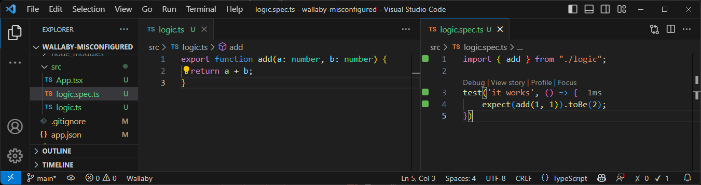

# wallaby-misconfigured

I'm used to having the square boxes on the left of the screen as well as the functionality of `// ?` working in other projects. Now I'm working on an Expo project and they are not there for the source files, only tests.

Jest was installed following the instructions here: https://docs.expo.dev/guides/testing-with-jest/

